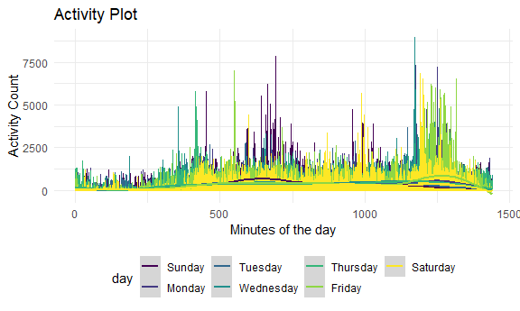

Homework 3
================
Sushupta Vijapur

``` r
library(tidyverse)
```

    ## -- Attaching packages ------------------------------------------------------------------------------------------------------------------------ tidyverse 1.3.0 --

    ## v ggplot2 3.3.2     v purrr   0.3.4
    ## v tibble  3.0.3     v dplyr   1.0.2
    ## v tidyr   1.1.2     v stringr 1.4.0
    ## v readr   1.3.1     v forcats 0.5.0

    ## -- Conflicts --------------------------------------------------------------------------------------------------------------------------- tidyverse_conflicts() --
    ## x dplyr::filter() masks stats::filter()
    ## x dplyr::lag()    masks stats::lag()

``` r
library(p8105.datasets)

knitr::opts_chunk$set(
  fig.width = 6,
  fig.asp = 0.6,
  out.width = "90%"
)

theme_set(theme_minimal() + theme(legend.position = "bottom"))

## all plots i make will have the viridis color palette
options(
  ggplot2.continuous.colour = "viridis",
  ggplot2.continuous.fill = "viridis"
)

scale_colour_discrete = scale_colour_viridis_d
scale_fill_discrete = scale_fill_viridis_d
```

## Problem 1

Load “instacart” dataset

``` r
data("instacart")
```

This dataset contains 1384617 rows and … columns

Observations are the level of itesm in the order by users. There are
user / order variables – user id, order id, order day and order hour.
There are also item variables – name, aisle, department and some numeric
codes.

### Part 1

How many aisles and which are the most items from?

``` r
instacart %>% 
  count(aisle) %>% 
  arrange(desc(n))
```

    ## # A tibble: 134 x 2
    ##    aisle                              n
    ##    <chr>                          <int>
    ##  1 fresh vegetables              150609
    ##  2 fresh fruits                  150473
    ##  3 packaged vegetables fruits     78493
    ##  4 yogurt                         55240
    ##  5 packaged cheese                41699
    ##  6 water seltzer sparkling water  36617
    ##  7 milk                           32644
    ##  8 chips pretzels                 31269
    ##  9 soy lactosefree                26240
    ## 10 bread                          23635
    ## # ... with 124 more rows

### Part 2

Make a plot that shows the number of items ordered in each aisle,
limiting this to aisles with more than 10000 items ordered. Arrange
aisles sensibly, and organize your plot so others can read it. Counting
produces a dataframe that we can manipulate

Notes for me: We want to rotate axis labels because they’re all
overlapping Order from least to most number of orders (change aisle to a
factor) “aisle = fct\_reorder(aisle, n)” reorder aisle by n

``` r
instacart %>% 
  count(aisle) %>% 
  filter(n > 10000) %>% 
  mutate(
    aisle = factor(aisle),
    aisle = fct_reorder(aisle, n)
  ) %>% 
  ggplot(aes(x = aisle, y = n)) +
  geom_point() +
  theme(axis.text.x = element_text(angle = 90, vjust = 0.5, hjust = 1))
```


### Part 3

Make a table showing the three most popular items in each of the aisles
“baking ingredients”, “dog food care”, and “packaged vegetables
fruits”. Include the number of times each item is ordered in your
table.

Notes for me: To do a ranking that is different for each aisle, we need
to group first Putting group\_by before count is important because in
the output we will retain the aisle. So it will count the n BY the
aisle.

``` r
instacart %>% 
  filter(aisle %in% c("baking ingredients", "dog food care", "packaged vegetables fruits")) %>% 
  group_by(aisle) %>% 
  count(product_name) %>% 
  mutate(rank = min_rank(desc(n))) %>% 
  filter(rank < 4) %>% 
  arrange(desc(aisle, rank)) %>% 
  knitr::kable()
```

| aisle                      | product\_name                                 |    n | rank |
| :------------------------- | :-------------------------------------------- | ---: | ---: |
| packaged vegetables fruits | Organic Baby Spinach                          | 9784 |    1 |
| packaged vegetables fruits | Organic Blueberries                           | 4966 |    3 |
| packaged vegetables fruits | Organic Raspberries                           | 5546 |    2 |
| dog food care              | Organix Chicken & Brown Rice Recipe           |   28 |    2 |
| dog food care              | Small Dog Biscuits                            |   26 |    3 |
| dog food care              | Snack Sticks Chicken & Rice Recipe Dog Treats |   30 |    1 |
| baking ingredients         | Cane Sugar                                    |  336 |    3 |
| baking ingredients         | Light Brown Sugar                             |  499 |    1 |
| baking ingredients         | Pure Baking Soda                              |  387 |    2 |

### Part 4

Make a table showing the mean hour of the day at which Pink Lady Apples
and Coffee Ice Cream are ordered on each day of the week; format this
table for human readers

``` r
instacart %>% 
  filter(product_name %in% c("Pink Lady Apples", "Coffee Ice Cream")) %>% 
  group_by(product_name, order_dow) %>% 
  summarize(mean_hour = mean(order_hour_of_day)) %>% 
  pivot_wider(
    names_from = order_dow,
    values_from = mean_hour
  )
```

    ## `summarise()` regrouping output by 'product_name' (override with `.groups` argument)

    ## # A tibble: 2 x 8
    ## # Groups:   product_name [2]
    ##   product_name       `0`   `1`   `2`   `3`   `4`   `5`   `6`
    ##   <chr>            <dbl> <dbl> <dbl> <dbl> <dbl> <dbl> <dbl>
    ## 1 Coffee Ice Cream  13.8  14.3  15.4  15.3  15.2  12.3  13.8
    ## 2 Pink Lady Apples  13.4  11.4  11.7  14.2  11.6  12.8  11.9

## Problem 2

### Part 1

``` r
accel_data = 
  read_csv("./data/accel_data.csv") %>% 
  janitor::clean_names() %>%
  pivot_longer(
    activity_1:activity_1440,
    names_to = "activity_count",
    values_to = "min_of_day"
  ) %>% 
  mutate(
    min_of_day = as.numeric(min_of_day),
    day_type = ifelse(day == "Saturday" | day == "Sunday", "weekend", "weekday")
  )
```

    ## Parsed with column specification:
    ## cols(
    ##   .default = col_double(),
    ##   day = col_character()
    ## )

    ## See spec(...) for full column specifications.

The results dataframe has 50400 rows and 6 columns. The data frame
includes week, day\_id and day of the week variables. I used the day
variable to create a day\_type variable which indicates whether it is a
weekday or a weekend. Furthermore, I pivoted the activity counts and
minutes variables to longer. Now there is an activity count and min of
the day variable in tidy format.

### Part 2

``` r
accel_data %>% 
  group_by(day) %>% 
  summarize(activity_count, min_of_day)
```

    ## `summarise()` regrouping output by 'day' (override with `.groups` argument)

    ## # A tibble: 50,400 x 3
    ## # Groups:   day [7]
    ##    day    activity_count min_of_day
    ##    <chr>  <chr>               <dbl>
    ##  1 Friday activity_1           88.4
    ##  2 Friday activity_2           82.2
    ##  3 Friday activity_3           64.4
    ##  4 Friday activity_4           70.0
    ##  5 Friday activity_5           75.0
    ##  6 Friday activity_6           66.3
    ##  7 Friday activity_7           53.8
    ##  8 Friday activity_8           47.8
    ##  9 Friday activity_9           55.5
    ## 10 Friday activity_10          43.0
    ## # ... with 50,390 more rows

groupby and summarize problem make sure day of the week is in the order
you want it to be

### Part 3

``` r
accel_data %>% 
  ggplot(aes(x = min_of_day, y = activity_count, color = day)) +
  geom_line()
```



24 hours of activity looks like in each minute in each day min on x
activity count on y. color is day of the week geom\_line might work
better than a scatter

## Problem 3

### Part 1

``` r
data("ny_noaa")
```

separate the date variable into 3 parts (day, month, year) use count
Data cleaning

``` r
ny_noaa %>% 
  separate(date, into = c("year", "day", "month")) %>% 
  mutate(
    prcp = as.numeric(prcp),
    snow = as.numeric(snow),
    snwd = as.numeric(snwd),
    tmax = as.numeric(tmax),
    tmin = as.numeric(tmin)
  )
```

    ## # A tibble: 2,595,176 x 9
    ##    id          year  day   month  prcp  snow  snwd  tmax  tmin
    ##    <chr>       <chr> <chr> <chr> <dbl> <dbl> <dbl> <dbl> <dbl>
    ##  1 US1NYAB0001 2007  11    01       NA    NA    NA    NA    NA
    ##  2 US1NYAB0001 2007  11    02       NA    NA    NA    NA    NA
    ##  3 US1NYAB0001 2007  11    03       NA    NA    NA    NA    NA
    ##  4 US1NYAB0001 2007  11    04       NA    NA    NA    NA    NA
    ##  5 US1NYAB0001 2007  11    05       NA    NA    NA    NA    NA
    ##  6 US1NYAB0001 2007  11    06       NA    NA    NA    NA    NA
    ##  7 US1NYAB0001 2007  11    07       NA    NA    NA    NA    NA
    ##  8 US1NYAB0001 2007  11    08       NA    NA    NA    NA    NA
    ##  9 US1NYAB0001 2007  11    09       NA    NA    NA    NA    NA
    ## 10 US1NYAB0001 2007  11    10       NA    NA    NA    NA    NA
    ## # ... with 2,595,166 more rows

Part 2 collection of data mani followed by a plotting step group by and
summarize problem groupby station, year, month and the summarize avg max
temp will need to filter for onlt january and july

Part 3 patchwork one is scatter plot maybe? or contour or hex plot one
is box, violin
