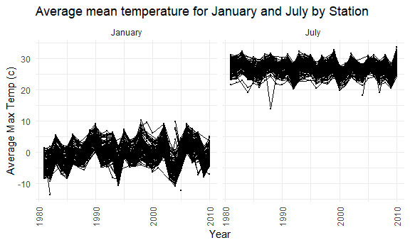
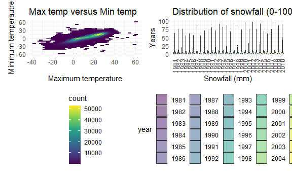

Homework 3
================
Sushupta Vijapur

``` r
library(tidyverse)
```

    ## -- Attaching packages ------------------------------- tidyverse 1.3.0 --

    ## v ggplot2 3.3.2     v purrr   0.3.4
    ## v tibble  3.0.3     v dplyr   1.0.2
    ## v tidyr   1.1.2     v stringr 1.4.0
    ## v readr   1.3.1     v forcats 0.5.0

    ## -- Conflicts ---------------------------------- tidyverse_conflicts() --
    ## x dplyr::filter() masks stats::filter()
    ## x dplyr::lag()    masks stats::lag()

``` r
library(p8105.datasets)
library(ggridges)
library(patchwork)

knitr::opts_chunk$set(
  fig.width = 6,
  fig.asp = 0.6,
  out.width = "90%"
)

theme_set(theme_minimal() + theme(legend.position = "bottom"))

## all plots i make will have the viridis color palette
options(
  ggplot2.continuous.colour = "viridis",
  ggplot2.continuous.fill = "viridis"
)

scale_colour_discrete = scale_colour_viridis_d
scale_fill_discrete = scale_fill_viridis_d
```

## Problem 1

Load “instacart” dataset

``` r
data("instacart")
```

This dataset contains 1384617 rows and … columns

Observations are the level of itesm in the order by users. There are
user / order variables – user id, order id, order day and order hour.
There are also item variables – name, aisle, department and some numeric
codes.

### Part 1

How many aisles and which are the most items from?

``` r
instacart %>% 
  count(aisle) %>% 
  arrange(desc(n))
```

    ## # A tibble: 134 x 2
    ##    aisle                              n
    ##    <chr>                          <int>
    ##  1 fresh vegetables              150609
    ##  2 fresh fruits                  150473
    ##  3 packaged vegetables fruits     78493
    ##  4 yogurt                         55240
    ##  5 packaged cheese                41699
    ##  6 water seltzer sparkling water  36617
    ##  7 milk                           32644
    ##  8 chips pretzels                 31269
    ##  9 soy lactosefree                26240
    ## 10 bread                          23635
    ## # ... with 124 more rows

### Part 2

Make a plot that shows the number of items ordered in each aisle,
limiting this to aisles with more than 10000 items ordered. Arrange
aisles sensibly, and organize your plot so others can read it. Counting
produces a dataframe that we can manipulate

Notes for me: We want to rotate axis labels because they’re all
overlapping Order from least to most number of orders (change aisle to a
factor) “aisle = fct\_reorder(aisle, n)” reorder aisle by n

``` r
instacart %>% 
  count(aisle) %>% 
  filter(n > 10000) %>% 
  mutate(
    aisle = factor(aisle),
    aisle = fct_reorder(aisle, n)
  ) %>% 
  ggplot(aes(x = aisle, y = n)) +
  geom_point() +
  theme(axis.text.x = element_text(angle = 90, vjust = 0.5, hjust = 1))
```


### Part 3

Make a table showing the three most popular items in each of the aisles
“baking ingredients”, “dog food care”, and “packaged vegetables
fruits”. Include the number of times each item is ordered in your
table.

Notes for me: To do a ranking that is different for each aisle, we need
to group first Putting group\_by before count is important because in
the output we will retain the aisle. So it will count the n BY the
aisle.

``` r
instacart %>% 
  filter(aisle %in% c("baking ingredients", "dog food care", "packaged vegetables fruits")) %>% 
  group_by(aisle) %>% 
  count(product_name) %>% 
  mutate(rank = min_rank(desc(n))) %>% 
  filter(rank < 4) %>% 
  arrange(desc(aisle, rank)) %>% 
  knitr::kable()
```

| aisle                      | product\_name                                 |    n | rank |
| :------------------------- | :-------------------------------------------- | ---: | ---: |
| packaged vegetables fruits | Organic Baby Spinach                          | 9784 |    1 |
| packaged vegetables fruits | Organic Blueberries                           | 4966 |    3 |
| packaged vegetables fruits | Organic Raspberries                           | 5546 |    2 |
| dog food care              | Organix Chicken & Brown Rice Recipe           |   28 |    2 |
| dog food care              | Small Dog Biscuits                            |   26 |    3 |
| dog food care              | Snack Sticks Chicken & Rice Recipe Dog Treats |   30 |    1 |
| baking ingredients         | Cane Sugar                                    |  336 |    3 |
| baking ingredients         | Light Brown Sugar                             |  499 |    1 |
| baking ingredients         | Pure Baking Soda                              |  387 |    2 |

### Part 4

Make a table showing the mean hour of the day at which Pink Lady Apples
and Coffee Ice Cream are ordered on each day of the week; format this
table for human readers

``` r
instacart %>% 
  filter(product_name %in% c("Pink Lady Apples", "Coffee Ice Cream")) %>% 
  group_by(product_name, order_dow) %>% 
  summarize(mean_hour = mean(order_hour_of_day)) %>% 
  pivot_wider(
    names_from = order_dow,
    values_from = mean_hour
  )
```

    ## `summarise()` regrouping output by 'product_name' (override with `.groups` argument)

    ## # A tibble: 2 x 8
    ## # Groups:   product_name [2]
    ##   product_name       `0`   `1`   `2`   `3`   `4`   `5`   `6`
    ##   <chr>            <dbl> <dbl> <dbl> <dbl> <dbl> <dbl> <dbl>
    ## 1 Coffee Ice Cream  13.8  14.3  15.4  15.3  15.2  12.3  13.8
    ## 2 Pink Lady Apples  13.4  11.4  11.7  14.2  11.6  12.8  11.9

## Problem 2

### Part 1

Load, tidy, and otherwise wrangle the data. Your final dataset should
include all originally observed variables and values; have useful
variable names; include a weekday vs weekend variable; and encode data
with reasonable variable classes. Describe the resulting dataset
(e.g. what variables exist, how many observations, etc).

``` r
accel_data = 
  read_csv("./data/accel_data.csv") %>% 
  janitor::clean_names() %>% 
   pivot_longer(
    activity_1:activity_1440,
    names_to = "min_of_day",
    names_prefix = "activity_",
    values_to = "activity_count"
  ) %>% 
  mutate(
    activity_count = as.numeric(activity_count),
    min_of_day = as.numeric(min_of_day),
    day_type = ifelse(day == "Saturday" | day == "Sunday", "weekend", "weekday"),
    day = factor(day),
    day = fct_relevel(day, "Sunday", "Monday", "Tuesday", "Wednesday", "Thursday", "Friday", "Saturday")
  )
```

    ## Parsed with column specification:
    ## cols(
    ##   .default = col_double(),
    ##   day = col_character()
    ## )

    ## See spec(...) for full column specifications.

The results data frame has 50400 rows and 6 columns. The data frame
includes week, day\_id and day of the week variables. I used the day
variable to create a day\_type variable which indicates whether it is a
weekday or a weekend. Furthermore, I pivoted the activity counts and
minutes variables to longer. Now there is an activity count and min of
the day variable in tidy format.Furthermore, by re-leveling the data,
the days of the week will be listed in intuitive order. Lastly, there is
a week variable which numbers the weeks during the observational period
(1-5 weeks). All this data was collected from a 63 year old man with a
BMI of 25 who was diagnosed with congestive heart failure.

### Part 2

Traditional analyses of accelerometer data focus on the total activity
over the day. Using your tidied data-set, aggregate across minutes to
create a total activity variable for each day, and create a table
showing these totals. Are any trends apparent?

``` r
accel_data %>% 
  group_by(day, week) %>% 
  summarize(total_act = sum(activity_count)) %>% 
  pivot_wider(
    names_from = day,
    values_from = total_act
  ) %>% 
   knitr::kable()
```

    ## `summarise()` regrouping output by 'day' (override with `.groups` argument)

| week | Sunday |    Monday |  Tuesday | Wednesday | Thursday |   Friday | Saturday |
| ---: | -----: | --------: | -------: | --------: | -------: | -------: | -------: |
|    1 | 631105 |  78828.07 | 307094.2 |    340115 | 355923.6 | 480542.6 |   376254 |
|    2 | 422018 | 295431.00 | 423245.0 |    440962 | 474048.0 | 568839.0 |   607175 |
|    3 | 467052 | 685910.00 | 381507.0 |    468869 | 371230.0 | 467420.0 |   382928 |
|    4 | 260617 | 409450.00 | 319568.0 |    434460 | 340291.0 | 154049.0 |     1440 |
|    5 | 138421 | 389080.00 | 367824.0 |    445366 | 549658.0 | 620860.0 |     1440 |

In weeks 4 and 5, the activity was particularly lower than in other
weeks and other days.

### Part 3

Accelerometer data allows the inspection activity over the course of the
day. Make a single-panel plot that shows the 24-hour activity time
courses for each day and use color to indicate day of the week. Describe
in words any patterns or conclusions you can make based on this graph.

``` r
accel_data %>% 
  ggplot(aes(x = min_of_day, y = activity_count, color = day)) +
  geom_line() +
  geom_smooth(aes(group = day)) +
  labs(
    title = "Activity Plot",
    x = "Minutes of the day",
    y = "Activity Count"
  )
```

    ## `geom_smooth()` using method = 'gam' and formula 'y ~ s(x, bs = "cs")'


``` r
  theme(axis.text.x = element_text(angle = 90, vjust = 0.5, hjust = 1))
```

    ## List of 1
    ##  $ axis.text.x:List of 11
    ##   ..$ family       : NULL
    ##   ..$ face         : NULL
    ##   ..$ colour       : NULL
    ##   ..$ size         : NULL
    ##   ..$ hjust        : num 1
    ##   ..$ vjust        : num 0.5
    ##   ..$ angle        : num 90
    ##   ..$ lineheight   : NULL
    ##   ..$ margin       : NULL
    ##   ..$ debug        : NULL
    ##   ..$ inherit.blank: logi FALSE
    ##   ..- attr(*, "class")= chr [1:2] "element_text" "element"
    ##  - attr(*, "class")= chr [1:2] "theme" "gg"
    ##  - attr(*, "complete")= logi FALSE
    ##  - attr(*, "validate")= logi TRUE

The plot above shows minutes of the day and activity counts by days of
the week (colors). By including a smooth line to show the average trend
by day, we are able to observe patterns more clearly. There seems to be
a noticeable peak in activity counts on Friday evening and around the
middle of the day on Sunday. Other than those clear peaks in the curves,
the rest of the activity counts seem to be around the same throughout
the day for each day of the week.

## Problem 3

### Part 1

Do some data cleaning. Create separate variables for year, month, and
day. Ensure observations for temperature, precipitation, and snowfall
are given in reasonable units. For snowfall, what are the most commonly
observed values? Why?

Load data

``` r
data("ny_noaa")
```

Clean data

``` r
ny_noaa =
  ny_noaa %>% 
  separate(date, c("year", "month", "day"), convert = TRUE) %>% 
  mutate(
    prcp = prcp / 100,
    snow = snow / 10,
    snwd = snwd / 10,
    tmax = as.numeric(tmax) / 10,
    tmin = as.numeric(tmin) / 10
  )
   

month_df = 
  tibble(
    month = 1:12,
    month_name = month.name
  )

tidy_ny_noaa = left_join(ny_noaa, month_df, by = "month")

ny_noaa %>% 
  count(snow) %>% 
  arrange(desc(n))
```

    ## # A tibble: 282 x 2
    ##     snow       n
    ##    <dbl>   <int>
    ##  1   0   2008508
    ##  2  NA    381221
    ##  3   2.5   31022
    ##  4   1.3   23095
    ##  5   5.1   18274
    ##  6   7.6   10173
    ##  7   0.8    9962
    ##  8   0.5    9748
    ##  9   3.8    9197
    ## 10   0.3    8790
    ## # ... with 272 more rows

This dataset contains 2595176 rows and 10 columns. I merged in a month
names variable to list the names of the months instead of the numbers.
FUrthermore, I converted tmin (minimum temperatue), tmax (maximum
temperature) and prcp (precipitation) to acceptable and readable units.
Furthermore, I split up the date variable into day, month and year. This
dataset also contains data on snowfall and snowdepth as well as the
stations across New York State reporting these numbers.

The most commonly observed value for snowfall in mm is 0. This is
probably due to the fact that the data is collected from NYS. For the
majority of a given year, there is not snow (Spring, Summer and most of
Fall).

### Part 2

Make a two-panel plot showing the average max temperature in January and
in July in each station across years. Is there any observable /
interpretable structure? Any outliers?

``` r
tidy_ny_noaa %>% 
  group_by(id, year, month_name) %>% 
  filter(month_name %in% c("January", "July")) %>% 
  summarize(
    mean_max_temp = mean(tmax, na.rm = TRUE)
  ) %>% 
  ggplot(aes(x = year, y = mean_max_temp, group = id)) +
  geom_point(size = 0.1) +
  geom_path(size = 0.1) +
  facet_grid(. ~ month_name) +
  labs(
    title = "Average mean temperature for January and July by Station",
    x = "Year",
    y = "Average Max Temp (c)"
  ) +
  theme(axis.text.x = element_text(angle = 90, vjust = 0.5, hjust = 1))
```

    ## `summarise()` regrouping output by 'id', 'year' (override with `.groups` argument)

    ## Warning: Removed 5970 rows containing missing values (geom_point).

    ## Warning: Removed 5931 row(s) containing missing values (geom_path).


Yes, there are two outliers in the July plot around 2005 and 2007, where
one is above the plot and the other is below the plow respectively. Most
of the mean temps lie between 10 and 30 degrees C. Therefore, there are
also some values that are far from the general average mean temp. For
example, in the January plot, around 1999, the average mean temp was
below -10 degrees C with would be considered an outlier. There are
several other instances like this in both months.The stations do overlap
over the time period in terms of max and min temps. Lastly, the mean
temp in July was higher than the mean temp in January.

### Part 3

Make a two-panel plot showing (i) tmax vs tmin for the full dataset
(note that a scatterplot may not be the best option); and (ii) make a
plot showing the distribution of snowfall values greater than 0 and less
than 100 separately by year

``` r
hex_plot = 
ny_noaa %>% 
  ggplot(aes(x = tmax, y = tmin)) +
  geom_hex() +
  theme(legend.direction = "vertical") +
  labs(
    title = "Max temp versus Min temp",
    x = "Maximum temperature",
    y = "Minimum temperautre"
  )
  

violin_plot = 
  ny_noaa %>% 
  filter(snow < 100, snow > 0, na.rm = TRUE) %>%
  group_by(year) %>% 
  mutate(
    year = as.factor(year)
  ) %>% 
  ggplot(aes(x = year, y = snow)) +
  geom_violin(aes(fill = year), alpha = 0.5) +
  labs(
    title = "Distribution of snowfall (0-100mm) by year",
    x = "Snowfall (mm)",
    y = "Years"
  ) +
  theme(axis.text.x = element_text(angle = 90, vjust = 0.5, hjust = 1))
  
hex_plot + violin_plot 
```

    ## Warning: Removed 1136276 rows containing non-finite values (stat_binhex).


From the hex plot of tmax versus tmin, we can see that while there is
some variability, the majority of the values are at the center of the
distribution.

From the violin plot we can see that was not a lot of the variability in
snowfall across the years of the study.
